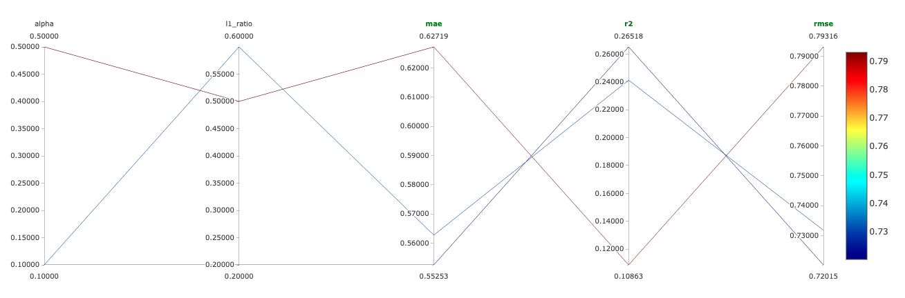

# Wine Tasting with ElasticNet in MLOps.

## Tools and Technologies:

- MLFlow

## Resources

**[Wine Tasting Mlops](https://www.youtube.com/watch?v=-NOIWzjJK-4&ab_channel=DSwithBappy)**

*Parallel Coordinates Plot*

## Steps Taken:

conda create -n mlops python=3.8 -y 

conda activate mlops

pip install -r requirements.txt

pip install --upgrade pippip install --upgrade pip

pip install certifi

python3 example.py

python3 example.py 0.1 0.2

python3 example.py 0.1 0.6

mlflow ui

pip install dagshub

## For Dagshub:

import dagshub
dagshub.init(repo_owner='saideep2000', repo_name='Wine-Tasting-Elasticnet-MLFlow', mlflow=True)

import mlflow
with mlflow.start_run():
  mlflow.log_param('parameter name', 'value')
  mlflow.log_metric('metric name', 1)

https://dagshub.com/saideep2000/Wine-Tasting-Elasticnet-MLFlow.mlflow

